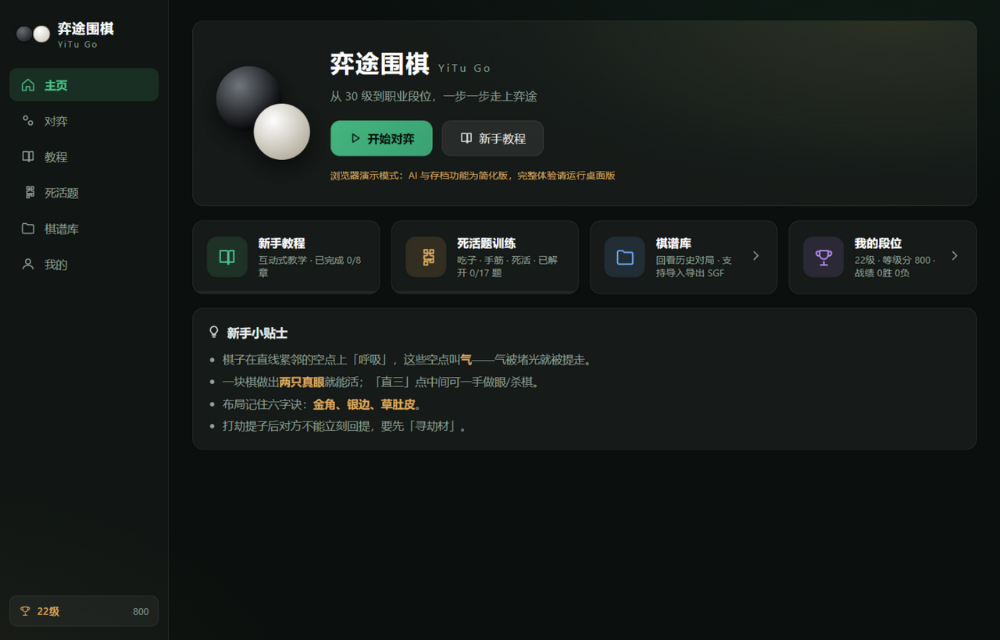
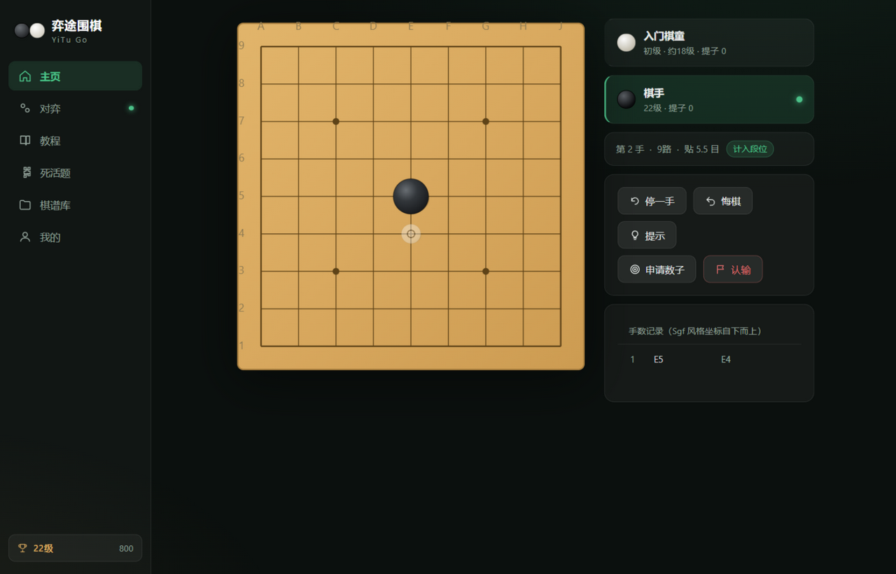
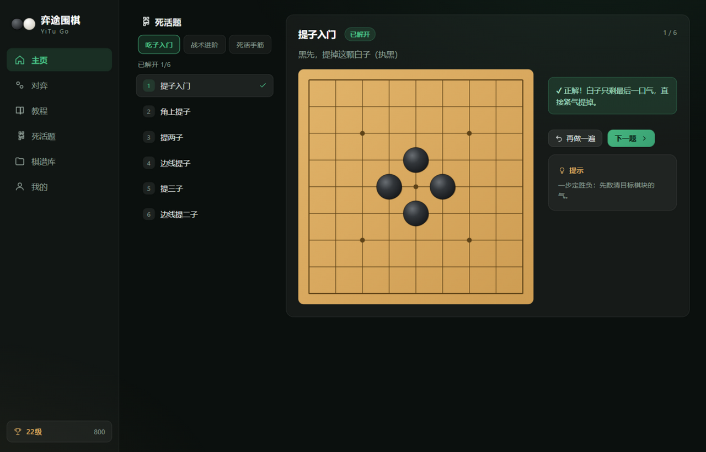

# 弈途围棋 (YiTu Go)

面向围棋新手的学习与对弈应用，使用 **Rust + Tauri 2 + React** 从零实现，支持 **Windows 桌面**与 **Android**。


| 主页 | 对弈 | 死活题 |
| --- | --- | --- |
|  |  |  |

## 功能一览

### ⛺ 对弈
- **完整围棋规则**（Rust 引擎）：提子、禁入点（自杀禁止）、打劫、中国规则数子法
- **10 级 AI 对手**：从「木木小童」到「职业棋士」，AI 严格遵守打劫规则
- **双引擎架构**（`GoEngine` trait，文档式分层）：
  - **KataGo**（可选，自动探测）：子进程 + analysis JSON 协议，随机 rollout 全部 replaced 为神经网络搜索；支持 humanSL 人类风格模型做段位分级（1~8 档按 rank_20k→rank_3d 概率采样，忠实还原该段位真实下法）
  - **内置引擎**（兜底，永远可用）：启发式 + 并行蒙特卡洛 + 征子读取；rollout 终局判定按中国规则数空（BFS 归属），修复了只数子不计空的胜率失真
  - KataGo 缺失/崩溃/超时自动降级到内置引擎，应用始终可玩
- **9 / 13 / 19 路**棋盘，执黑/执白可选，**让 2~9 子**让子棋
- **计段位对局**：Elo 等级分，胜升负降，段位自动晋升（30级 → 1级 → 业余段 → 职业段）
- 双人对弈（同屏轮流）
- 自动存档：中途关闭应用，下次可一键「继续对局」
- 终局**数子阶段**：点击棋子标记死子（整块切换），实时预览领地
- 新手辅助：悔棋、提示（AI 顺手）、停一手、落子二次确认、领地（势力范围）显示、坐标开关、音效（WebAudio 合成，无素材依赖）

### 📖 新手教程（12 章闯关）
初识围棋 → 气 → 提子与救子 → 禁入点 → 打劫 → 死活基础 → 终局与胜负 → 布局常识 → **连接与切断 → 布局初步 → 定式入门 → 官子与复盘**。
互动式任务在棋盘上亲手完成提子、逃跑、做眼、点杀、寻劫材、连接、切断等操作；新增 **19 路演示步骤**（三连星布局、星定式、小目定式逐步播放），答对方可进入下一步，进度自动保存。

### 🧩 死活题训练（23 题 · 3 阶梯）
吃子入门（8 题）→ 战术进阶（双打吃/一子双提/反提/追杀向边/对杀紧气，8 题）→ 死活手筋（点杀直三/曲三、倒扑、做眼、断吃，7 题）。
多手题带脚本化最强应手，支持重来与看答案演示。所有题解经自动化脚本验证（`npm run verify`，62 项检查）。

### 📐 定式库（8 例 · 逐步演示）
- **布局**：对角星、二连星、三连星、中国流（低中国流框架）
- **定式**：星小飞挂定式、小目小飞挂定式、星位小飞守角、小目无忧角
每例配逐步演示（上一手/下一手/自动播放/进度条）与详解，着法均经引擎验证合法且无提子。

### 🗂 棋谱库
- 对局结束自动保存，可随时**复盘**：逐手前进/后退、拖动进度条、自动播放
- **AI 复盘分析**（需 KataGo）：整局逐手胜率曲线、双方失误标记（跌 ≥10% 标记、≥20% 大失误）、点击曲线跳转任意手
- **导出 / 导入 SGF**（标准围棋棋谱格式，可与野狐、SGF 查看器等互通）
- 记录对手、结果、手数、终局方式

### 🎨 界面与个性化
- **深色 / 浅色主题**一键切换（暖纸浅色 / 墨绿深色）
- **侧边栏收缩**为纯图标模式，状态自动记忆
- 棋子采用多层渐变 + 高光 + 接触阴影，模拟蛤碁石 / 黑曜石质感
- **战绩曲线图**：等级分历史折线，胜负染色，悬停查看详情

## 开发

```bash
npm install          # 安装前端依赖
npm run verify       # 校验教程/死活题内容正确性（62 项检查）
npm run dev          # 前端热更新开发（浏览器演示模式，AI 为简化版）
npm run tauri dev    # 完整桌面应用开发模式
cargo test           # Rust 引擎单元测试（提子/劫/禁入点/数目/悔棋/让子/AI）
npm run tauri build  # 打包 Windows NSIS 安装程序
```

### 构建 Android 版

环境要求：JDK 17、Android SDK（platform-tools / platforms;android-36 / build-tools;36.0.0（模板 compileSdk=36） / NDK r26c），Rust 目标 `aarch64-linux-android` 等：

```bash
rustup target add aarch64-linux-android armv7-linux-androideabi i686-linux-android x86_64-linux-android
npx tauri android init          # 生成安卓工程（gen/android，仅首次）
node scripts/fix-android-gen.mjs  # 打两处 Windows 构建补丁（仅首次/重新 init 后）
npx tauri android build --apk --target aarch64   # 生成 release APK
```

产物在 `src-tauri/gen/android/app/build/outputs/apk/universal/release/`（未签名）；用 `build-tools/<版本>/zipalign + apksigner` 签名后即可安装。注意：项目路径请避免非 ASCII 字符，或使用 `android.overridePathCheck=true` 覆盖。

### 启用 KataGo 引擎（可选，桌面端）

应用启动时自动探测 `%LOCALAPPDATA%/com.yitugo.app/katago/`（或对应平台 app_data_dir）目录，存在以下文件即启用，否则使用内置引擎：

| 文件 | 说明 |
| --- | --- |
| `katago.exe` | KataGo analysis 引擎（v1.15.x Eigen/EigenAVX2 Windows 版，v1.18 仅发 CUDA 版） |
| `model.bin.gz` | **正常模型**（推荐 `kata1-b18c384nbt`，约 94MB，来自 katagotraining.org） |
| `human.bin.gz` | 可选：humanSL 模型 `b18c384nbt-humanv0.bin.gz`（99MB，v1.15.0 release 提供）——启用后 1~9 档按段位 profile 采样，忠实还原各段位真实下法 |
| `katago.cfg` | 缺省时自动生成（Eigen 档：4 线程 + maxTime 3s 兜底） |

- 双模型就绪时：1~9 档走 humanSL 段位采样（含 `humanSLChosenMoveProp` 混合），第 10 档为纯 KataGo 满配搜索；仅单模型时自动降级为全档位 profile 采样
- humanSL 模型**只负责选点**；胜率/目差永远取自正常模型（避免 humanSL 胜率偏见，文档 5.1）
- **AI 复盘**：复盘页「开始 AI 分析」逐手评估整局（默认每手 24 visits，逐批进行带进度显示）

- 探测过程全自动：humanSL 模型需要 `humanSLProfile` 声明，适配器通过探针查询自动适配并重启
- 「提示」按钮固定使用正常搜索模式，不随对局档位变化（hint 语义）
- Android 端 NDK 集成（libkatago.so + dlopen）在路线图中，当前安卓使用内置引擎

### 结构

```
src-tauri/            Rust 后端
  src/engine.rs       围棋规则引擎 + AI（启发式 + MC 模拟）
  src/commands.rs     Tauri 命令层（对局/棋谱/档案）
  src/store.rs        档案、棋谱、自动存档持久化
  src/sgf.rs          SGF 导入导出
src/                  React 前端
  engine.ts           TS 规则引擎（教程/死活题/回放/浏览器演示）
  content.json        教程与死活题内容（前后端共用的数据源）
  goal.ts             任务目标判定（与验证脚本同源逻辑）
  views/              主页 / 对弈 / 教程 / 死活题 / 棋谱库 / 我的
scripts/
  verify-content.mjs  内容自动化验证
  gen-icon.mjs        图标生成（纯 Node 绘制 PNG）
```

### 数据存放位置
个人档案、棋谱、自动存档保存在系统应用数据目录（Windows: `%APPDATA%/com.yitugo.app`）。

## 环境要求
- Node.js ≥ 18、Rust ≥ 1.77（MSVC 工具链）、WebView2（Win10/11 自带）
- 打包时若 cargo 拉取依赖受系统代理干扰，可设置 `NO_PROXY="*"` 后重试
